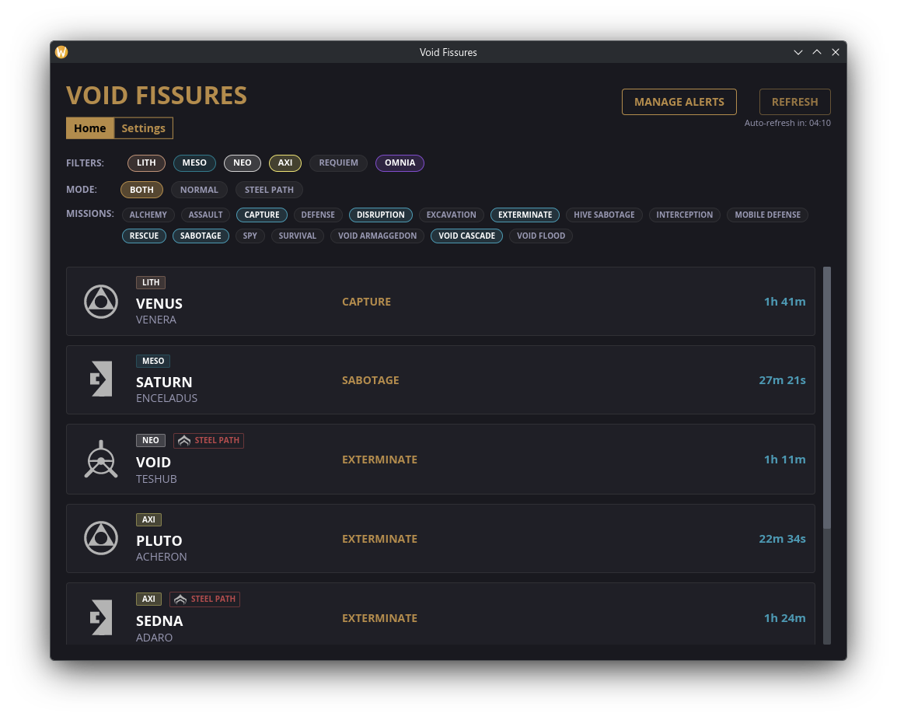
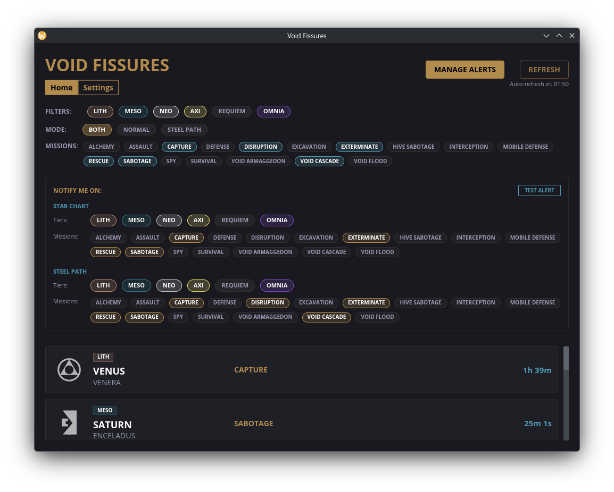
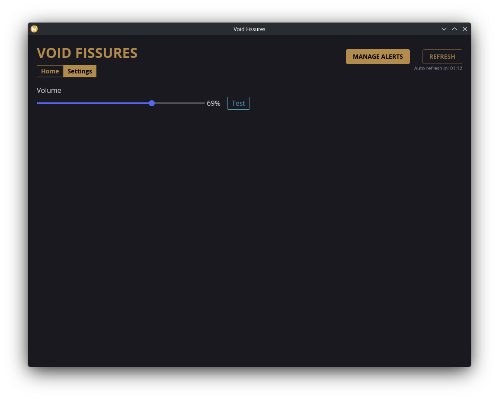

# wf-hub

A lightweight app that aims to handle various of Warframe-related tasks - from checklists to info gathering.

Currently only supports fissure previews & alerts.

Open source, free and ad-free. Forever.

## Native

Webviews have gotten pretty lightweight, but they still can't really compete with a true native binary. This app is built with Rust and Iced, meaning it renders to the GPU directly. You get instant startup times, smooth rendering, and a tiny memory footprint.

## Images

